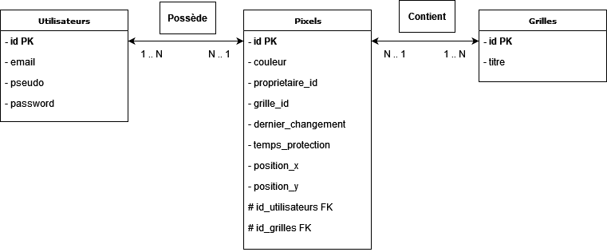

# ProjetBDD_PixelWar

## Modèle de la base de donnée :


## To Do 
Faute de temps les règles suivantes n'ont pas été implémentée/ ou ne elles ne fonctionnaient pas :
- L'utilisateur ne peut changer la couleur d'un pixel que toute les 15 secondes
- Après modification, un pixel est protégé pendant 30 secondes
- Réinitialisation du mdp de l'utilisateur
- Mail de confirmation d'inscription

## Requete SQL :
La base de donnée n'est pas sensible a la casse

```sql
CREATE TABLE Utilisateurs (
    id INT AUTO_INCREMENT PRIMARY KEY,
    email VARCHAR(255) UNIQUE NOT NULL,
    pseudo VARCHAR(50) UNIQUE NOT NULL,
    password VARCHAR(255) NOT NULL
);

CREATE TABLE Grilles ( 
    id INT AUTO_INCREMENT PRIMARY KEY, 
    titre VARCHAR(100) NOT NULL 
);

CREATE TABLE Pixels (
    id INT AUTO_INCREMENT PRIMARY KEY,
    couleur VARCHAR(7) NOT NULL,
    proprietaire_id INT NOT NULL,
    position_x INT NOT NULL,
    position_y INT NOT NULL,
    grille_id INT NOT NULL,
    dernier_changement TIMESTAMP DEFAULT CURRENT_TIMESTAMP ON UPDATE CURRENT_TIMESTAMP,
    temps_protection TIMESTAMP DEFAULT CURRENT_TIMESTAMP ON UPDATE CURRENT_TIMESTAMP,
    FOREIGN KEY (proprietaire_id) REFERENCES Utilisateurs(id),
    FOREIGN KEY (grille_id) REFERENCES Grilles(id)
);
```
